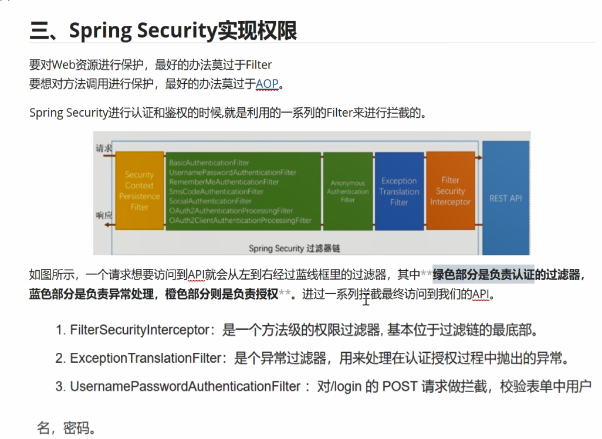
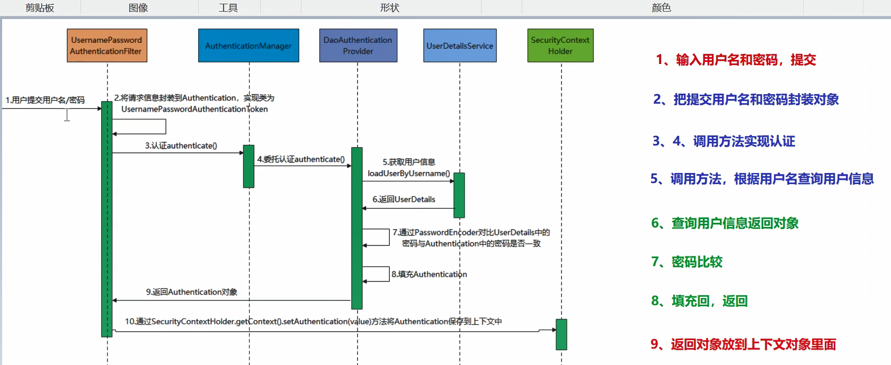
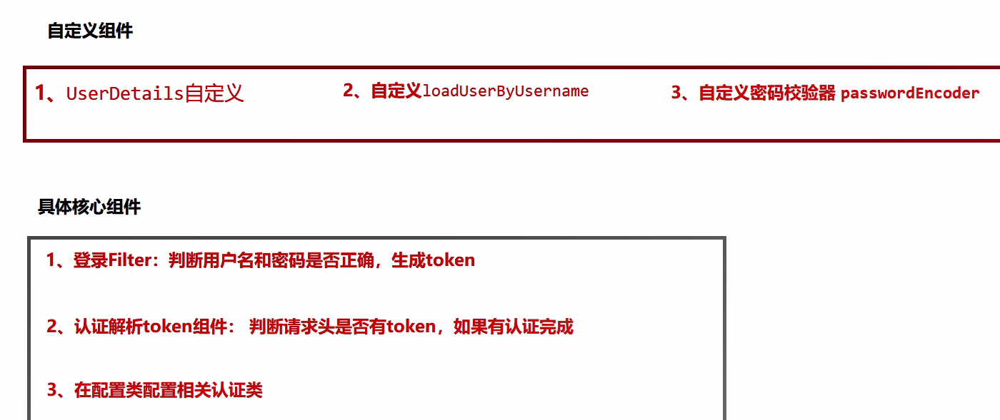
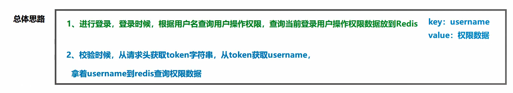
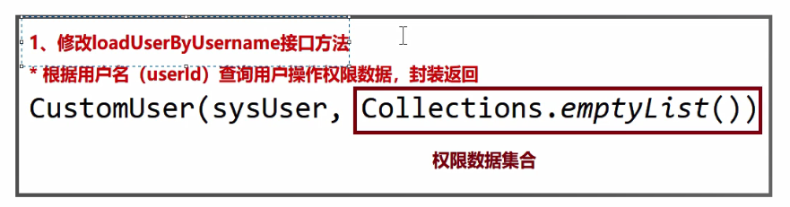
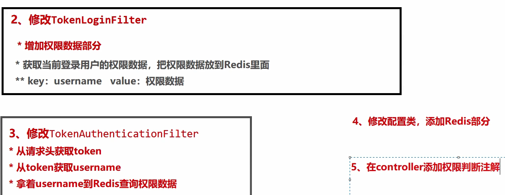

common-util 项目工具模块
service-util 业务工具模块

springsectrity
1.FilteerSecurityInterceptor: 是一个方法级的权限过滤器，基于过滤链的最底部
2.ExceptionTranslationFileter     是个异常过滤器，用来处理在认证过程中抛出的异常
3.UsernamePasswordAuthenticationFilter: 是一个认证过滤器，用来处理登录请求(对login的post请求做拦截，校验表单中的用户名和密码)

4，认证过程：

5：项目需要自定义组件：

6：授权过程：

